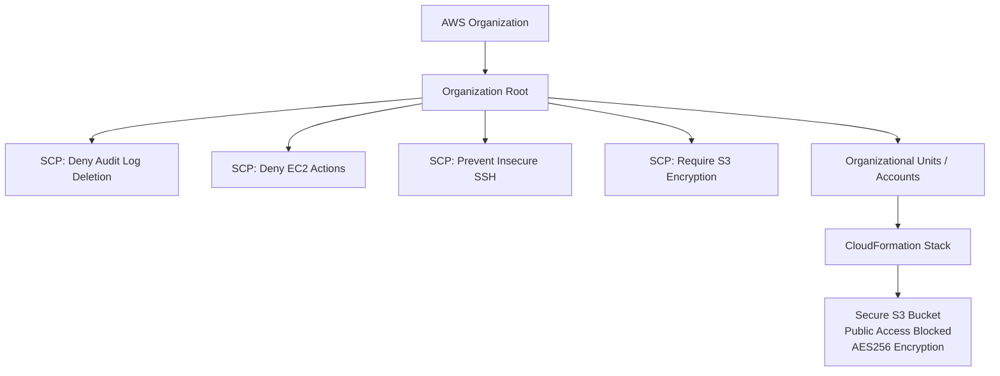

# AWS Compliance as Code

This project implements compliance controls as code using AWS Service Control Policies (SCPs) and CloudFormation. Rather than relying on manual compliance checks, I built automated, enforceable guardrails that prevent non-compliant actions at the AWS Organization level and deploy secure infrastructure by default.

The controls in this repository map to requirements from CJIS Security Policy, FedRAMP, and NIST 800-53, demonstrating how compliance frameworks translate into real, enforceable cloud infrastructure policies.

## Architecture Overview



SCPs are attached at the Organization Root, enforcing preventive guardrails across all accounts. These policies override IAM permissions, including administrator access, so non-compliant actions are blocked before they happen. CloudFormation templates are deployed into individual accounts to provision resources that meet security baselines without manual configuration. Together, they create a defense-in-depth model where organization-level policies and account-level infrastructure work in tandem.

## Compliance Frameworks

### CJIS Security Policy

The FBI's [CJIS Security Policy](https://le.fbi.gov/file-repository/cjis_security_policy_v6-0_20241227.pdf) establishes security requirements for any organization that accesses, stores, or transmits Criminal Justice Information (CJI). This includes law enforcement agencies, cloud service providers hosting CJI, and contractors supporting criminal justice systems. Version 6.0 (released December 2024) restructured the policy from 13 to 20 policy areas, now organized by NIST 800-53 control families: Access Control (AC), Auditing and Accountability (AU), Configuration Management (CM), Systems and Communications Protection (SC), and others. Controls use NIST 800-53 identifiers directly, aligning CJIS requirements with federal cybersecurity standards. Version 6.0 introduces priority levels (P1 through P4) for phased implementation, with FBI audits underway as of October 2025 and full compliance expected by October 2027.

### FedRAMP

The [Federal Risk and Authorization Management Program (FedRAMP)](https://www.fedramp.gov/) standardizes security assessments for cloud service providers (CSPs) serving federal agencies. FedRAMP defines three authorization baselines, Low, Moderate, and High, corresponding to the FIPS 199 impact level of the data being processed. Each baseline specifies a set of required NIST 800-53 controls. This project targets FedRAMP High, which requires the most comprehensive set of security controls and applies to systems processing the government's most sensitive unclassified data.

### NIST SP 800-53 Rev. 5

[NIST Special Publication 800-53 Revision 5](https://csf.tools/reference/sp-800-53/r5/) is the authoritative catalog of security and privacy controls for federal information systems. It serves as the foundation for both CJIS and FedRAMP requirements. Controls are organized into families (AC for Access Control, AU for Audit, SC for System and Communications Protection, CM for Configuration Management) and provide the technical specificity needed to translate compliance requirements into enforceable infrastructure policies.

## Controls Implemented

| Control | File | Type | What It Enforces | Security Principle |
|---|---|---|---|---|
| Deny Audit Log Deletion | `scp-deny-audit-log-deletion.json` | SCP (Preventive) | Blocks `cloudtrail:DeleteTrail` and `cloudtrail:StopLogging` across the organization | Audit Integrity |
| Deny EC2 Actions | `scp-deny-ec2-actions.json` | SCP (Preventive) | Denies all EC2 actions (`ec2:*`) org-wide, restricting unauthorized compute usage | Least Functionality |
| Prevent Insecure SSH | `scp-prevent-insecure-ssh.json` | SCP (Preventive) | Blocks security group rules that open SSH (port 22) to `0.0.0.0/0` in `us-west-1` | Network Boundary Protection |
| Require S3 Encryption | `scp-require-s3-encryption.json` | SCP (Preventive) | Denies S3 bucket creation when encryption is not enabled | Data Protection at Rest |
| Secure S3 Bucket | `secure-bucket.yaml` | CloudFormation (IaC) | Deploys an S3 bucket with all public access blocked and AES256 server-side encryption | Secure by Default |

## Compliance Framework Mapping

Each control was selected to address specific compliance requirements across CJIS Security Policy, FedRAMP, and NIST 800-53. The combination of preventive SCPs and compliant-by-default IaC templates creates layered enforcement; SCPs act as guardrails that cannot be bypassed even by IAM administrators, while CloudFormation ensures new resources are provisioned to meet baseline security requirements without manual configuration.

| Control | CJIS Security Policy (v6.0) | FedRAMP Baseline | NIST 800-53 Rev. 5 |
|---|---|---|---|
| Deny Audit Log Deletion | AU-9 (Protection of Audit Information), AU-12 (Audit Record Generation) | AU-9 (L/M/H), AU-12 (L/M/H) | AU-9 (Protection of Audit Information), AU-12 (Audit Record Generation) |
| Deny EC2 Actions | CM-7 (Least Functionality), AC-6 (Least Privilege) | CM-7 (L/M/H), AC-6 (M/H) | CM-7 (Least Functionality), AC-6 (Least Privilege) |
| Prevent Insecure SSH | SC-7 (Boundary Protection), AC-17 (Remote Access) | SC-7 (L/M/H), AC-17 (L/M/H) | SC-7 (Boundary Protection), AC-17 (Remote Access) |
| Require S3 Encryption | SC-28 (Protection of Information at Rest), SC-13 (Cryptographic Protection) | SC-28 (M/H), SC-13 (L/M/H) | SC-28 (Protection of Information at Rest), SC-13 (Cryptographic Protection) |
| Secure S3 Bucket (CFn) | SC-28 (Protection of Information at Rest), AC-3 (Access Enforcement) | SC-28 (M/H), AC-3 (L/M/H) | SC-28 (Protection of Information at Rest), AC-3 (Access Enforcement) |

> **Note:** CJIS v6.0 now uses NIST 800-53 control identifiers directly, so the CJIS and NIST columns share the same control IDs. The distinction is that CJIS scopes these requirements specifically to Criminal Justice Information (CJI), while NIST 800-53 applies broadly to federal information systems.

> **FedRAMP Baseline Key:** L = Low, M = Moderate, H = High

## Repository Structure

```
aws-compliance-as-code/
├── secure-bucket.yaml                  # CloudFormation: Secure S3 bucket (public access block + AES256)
├── scp-deny-audit-log-deletion.json    # SCP: Prevent CloudTrail deletion/stop logging
├── scp-deny-ec2-actions.json           # SCP: Deny all EC2 actions org-wide
├── scp-prevent-insecure-ssh.json       # SCP: Block SSH port 22 open to 0.0.0.0/0 (us-west-1)
├── scp-require-s3-encryption.json      # SCP: Require encryption on S3 bucket creation
├── LICENSE.txt                         # MIT License
└── README.md
```

## AWS Services Used

- **[AWS Organizations](https://aws.amazon.com/organizations/)**: Hosts the SCPs and enforces guardrails across the account hierarchy
- **[AWS CloudFormation](https://aws.amazon.com/cloudformation/)**: Deploys compliant infrastructure as code (secure S3 bucket template)
- **[AWS IAM](https://aws.amazon.com/iam/)**: Underlying permission system that SCPs override at the organization level
- **[AWS S3](https://aws.amazon.com/s3/)**: Target service for the secure bucket deployment and encryption enforcement
- **[AWS CloudTrail](https://aws.amazon.com/cloudtrail/)**: Audit logging service protected by the audit log deletion SCP
- **[AWS CLI](https://aws.amazon.com/cli/)**: Interface for deploying SCPs and CloudFormation stacks

## How It Works

### Service Control Policies (Preventive Guardrails)

SCPs are attached at the Organization Root and act as permission boundaries that override IAM, even for administrator users. They are preventive controls: non-compliant actions are denied before they execute, regardless of the IAM policies attached to the requesting principal. This makes them ideal for enforcing compliance boundaries that individual account configurations cannot circumvent.

### CloudFormation (Compliant by Default)

CloudFormation templates encode security requirements directly into resource definitions. The secure S3 bucket template in this project provisions a bucket with public access blocked and encryption enabled every time it deploys, eliminating the possibility of configuration drift or manual misconfiguration. The template itself serves as auditable documentation of the intended secure state.

### Defense in Depth

SCPs prevent non-compliant actions at the organization level. CloudFormation ensures compliant defaults at the resource level. Git version control tracks every policy and template change, creating an auditable history that serves as evidence for compliance audits. This layered approach means a failure in one control does not compromise the overall security posture.

## Deployment

<details>
<summary>Click to expand deployment instructions</summary>

### Prerequisites

- AWS account with Organizations enabled
- IAM user with appropriate permissions
- AWS CLI v2 installed and configured

### Step 1: Discover Organization IDs

**Get Organization Root ID:**

```
aws organizations list-roots \
    --query "Roots[0].Id" \
    --output text
```

Example output:

```
r-abcd
```

**List Organizational Units (if applicable):**

```
aws organizations list-organizational-units-for-parent \
    --parent-id <ROOT_ID> \
    --query "OrganizationalUnits[*].Id" \
    --output text
```

Example output:

```
ou-abcd-12345678 ou-abcd-87654321 ou-abcd-a1b2c3d4
```

### Step 2: Deploy Service Control Policies

**Create each SCP:**

```
aws organizations create-policy \
    --content file://<SCP_FILENAME>.json \
    --name <SCP_NAME> \
    --description "<POLICY_DESCRIPTION>" \
    --type SERVICE_CONTROL_POLICY
```

Replace `<SCP_FILENAME>` and `<SCP_NAME>` with the appropriate values for each policy.

Example output:

```
{
    "Policy": {
        "PolicySummary": {
            "Id": "p-0abc1234",
            "Arn": "arn:aws:organizations::123456789012:policy/service_control_policy/p-0abc1234",
            "Name": "SCP-DenyAuditLogDeletion",
            "Description": "Prevents the deletion of audit logs.",
            "Type": "SERVICE_CONTROL_POLICY",
            "AwsManaged": false
        },
        "Content": "..."
    }
}
```

**List deployed SCPs:**

```
aws organizations list-policies \
    --filter SERVICE_CONTROL_POLICY \
    --query "Policies[].{Name:Name, Id:Id}" \
    --output table
```

Example output:

```
----------------------------------------------
|              ListPolicies                  |
----------------------------------------------
|     Name                     |     Id       |
|------------------------------|--------------|
|  SCP-DenyRootUserActions     |  p-1a2b3c4d  |
|  SCP-DenyAuditLogDeletion    |  p-5e6f7g8h  |
|  SCP-PreventOpenSSH          |  p-9j0k1l2m  |
----------------------------------------------
```

**Attach each SCP to the Organization Root:**

```
aws organizations attach-policy \
    --policy-id <POLICY_ID> \
    --target-id <ROOT_ID>
```

**Verify SCPs are attached:**

```
aws organizations list-policies-for-target \
    --target-id <ROOT_ID> \
    --filter SERVICE_CONTROL_POLICY \
    --output table
```

Example output:

```
------------------------------------------------------
|              ListPoliciesForTarget                 |
------------------------------------------------------
|     Name                     |        Id           |
|----------------------------------------------------|
|  SCP-DenyRootUserActions     |  p-1a2b3c4d         |
|  SCP-DenyAuditLogDeletion    |  p-5e6f7g8h         |
------------------------------------------------------
```

### Step 3: Deploy CloudFormation Stack

```
aws cloudformation deploy \
    --stack-name <STACK_NAME> \
    --template-file <STACK_FILENAME.yaml> \
    --capabilities CAPABILITY_NAMED_IAM CAPABILITY_AUTO_EXPAND \
    --parameter-overrides \
        OrganizationId=<YOUR_ORG_ID> \
        OrgRootId=<ORG_ROOT_ID>
```

Example output:

```
Waiting for changeset to be created..
Waiting for stack create/update to complete
Successfully created/updated stack - <BUCKET_NAME>
```

**Verify deployment:**

```
aws cloudformation describe-stacks \
    --query "Stacks[*].StackName" \
    --output table
```

### Updating Policies and Templates

**Update an SCP:**

```
aws organizations update-policy \
    --policy-id <POLICY_ID> \
    --content file://<UPDATED_SCP>.json
```

**Update a CloudFormation stack:**

```
aws cloudformation deploy \
    --stack-name <STACK_NAME> \
    --template-file <STACK_FILENAME>.yaml \
    --capabilities CAPABILITY_NAMED_IAM CAPABILITY_AUTO_EXPAND
```

### Resource Cleanup

**Detach SCPs:**

```
aws organizations detach-policy \
  --policy-id <POLICY_ID> \
  --target-id <ORG_ROOT_ID>
```

**Delete CloudFormation stack:**

```
aws cloudformation delete-stack \
  --stack-name <STACK_NAME>
```

</details>

## Key Takeaways

- **Compliance as Code eliminates drift**: By encoding security requirements in CloudFormation, resources are provisioned correctly every time without relying on manual configuration.

- **SCPs enforce boundaries that IAM cannot**: Organization-level policies override even administrator permissions, providing a compliance layer that individual account configurations cannot circumvent.

- **Defense in depth through layered controls**: Preventive SCPs combined with compliant-by-default IaC creates multiple enforcement points, so a failure in one layer does not compromise the security posture.

- **Automation reduces human error**: Codified controls eliminate the inconsistency of manual reviews and create a repeatable, scalable compliance process.

- **Version control as audit evidence**: Every policy change is tracked in Git, providing a complete history that serves as compliance evidence during audits.

## What This Project Demonstrates

This project demonstrates the core GRC Engineering skill of translating compliance framework requirements into enforceable AWS controls. It showcases hands-on experience with AWS Organizations policy design, SCP authoring with condition-based logic, CloudFormation template development, and compliance framework mapping across CJIS Security Policy, FedRAMP, and NIST 800-53. The inclusion of CJIS and FedRAMP mappings reflects relevance to criminal justice environments and federal cloud authorization requirements.

The controls were selected to illustrate a range of enforcement patterns, from broad service restrictions (`ec2:*` deny) to condition-based rules (SSH port + CIDR + region matching) to encryption mandates, demonstrating the flexibility of SCPs as a compliance enforcement mechanism.

This foundation positions the project for expansion into CI/CD pipeline guardrails, AWS Config rules for continuous compliance monitoring, drift remediation automation, and multi-account architectures with OU-scoped policies.

## References

The following resources informed the design of this project:

- [FBI CJIS Security Policy v6.0](https://le.fbi.gov/file-repository/cjis_security_policy_v6-0_20241227.pdf)
- [FedRAMP Security Controls Baselines](https://www.fedramp.gov/baselines/)
- [GRC Engineering for AWS by AJ Yawn](https://ajyawn.com/books)
- [GRC Engineering for AWS Chapter 5 Repository](https://github.com/ajy0127/thegrcengineeringbook/tree/master/chapter-5)
- [NIST SP 800-53 Rev. 5: Security and Privacy Controls](https://csf.tools/reference/sp-800-53/r5/)
- [NIST SP 800-53B: Control Baselines for Information Systems](https://csrc.nist.gov/pubs/sp/800/53/b/upd1/final)
